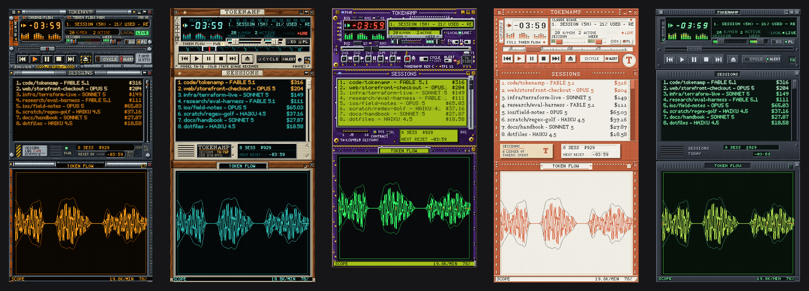
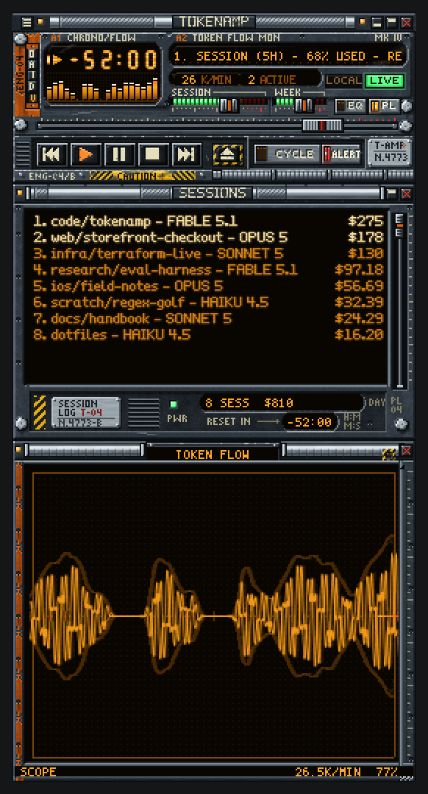

<p align="center">
  
</p>

<h1 align="center">Tokenamp</h1>

<p align="center"><strong>Your Claude plan usage, as a Winamp 2.x player.</strong><br>
A native macOS app with real classic <code>.wsz</code> skins, five of them hand-painted pixel by pixel.</p>

<p align="center">
  macOS 13+ &nbsp;·&nbsp; Swift / AppKit &nbsp;·&nbsp; read-only, no telemetry &nbsp;·&nbsp; MIT
</p>

<p align="center">
  <a href="https://github.com/lobabobloblaw/tokenamp/releases/latest"><strong>Download for macOS</strong></a>
  &nbsp;·&nbsp;
  <a href="https://github.com/lobabobloblaw/tokenamp/actions/workflows/ci.yml"></a>
</p>

<p align="center">
  
</p>

## What you're looking at



Every part of the player shows something about your plan:

| Player part | Shows |
|---|---|
| Time display | Countdown to your next limit reset |
| Marquee | Session and weekly use, burn rate, today's total |
| Volume / balance | Session and weekly limits, green to red |
| ⏮ ⏭ and seek bar | Step through your limits; how far into its window each one is |
| Visualiser | Token flow over the last six minutes |
| Playlist → **Sessions** | Today's projects, with model and cost |
| Equalizer | The last ten minutes, hours or days |
| **Token Flow** window | A phosphor display of your activity (below) |

Hover any gauge for its exact reading. **CYCLE** rotates through your limits; **ALERT** notifies you
at 75, 90 and 100 %. Double-click a title bar for window-shade mode. The windows dock together and
move as one stack, the way Winamp's did.

<br clear="right">

## Install

Download `Tokenamp-<version>.zip` from the [latest release](https://github.com/lobabobloblaw/tokenamp/releases/latest),
unzip it and move **Tokenamp** to Applications. It runs on Apple silicon and Intel Macs with
macOS 13 or later.

Tokenamp reads from a signed-in [Claude Code](https://claude.com/claude-code) on the same Mac.
To try it on made-up data instead, run `/Applications/Tokenamp.app/Contents/MacOS/Tokenamp --demo`.

### First launch

Tokenamp isn't notarized by Apple yet, so macOS stops it the first time you open it. You allow it
once per download.

- **macOS 15 and later:** open Tokenamp, and click **Done** when macOS says it was not opened. Then
  go to **System Settings → Privacy & Security**, scroll down, and click **Open Anyway** next to
  Tokenamp. (Right-click → Open no longer skips this check.)
- **macOS 13 and 14:** right-click Tokenamp in Applications, choose **Open**, then **Open** again.
- **From Terminal, any version:** `xattr -dr com.apple.quarantine /Applications/Tokenamp.app`.
  Only do this for a copy from this repository's Releases page; each release lists its SHA-256.

### Build from source

You need only the Xcode Command Line Tools (full Xcode is not needed):

```sh
git clone https://github.com/lobabobloblaw/tokenamp.git
cd tokenamp
scripts/build_app.sh
cp -R build/Tokenamp.app /Applications/
```

## Privacy

Tokenamp only reads, and sends nothing anywhere except one request to Anthropic:

- **Plan limits** come from `api.anthropic.com/api/oauth/usage`, using the token Claude Code already
  keeps in your keychain. Tokenamp never writes, refreshes or forwards that token.
- **Activity** comes from Claude Code's transcripts in `~/.claude/projects`. Only timestamps, model
  names, token counts and the project folder are read. **Your messages are never read, stored or
  shown.**
- No telemetry, no uploads.

Costs are API list prices (including cache and fast mode). They show what the work would cost on
the API, not what your plan charges. You can edit the table in
`~/Library/Application Support/Tokenamp/pricing.json`.

## Using it

Right-click any window, or click the menu-bar item, for options:

- **Windows** — Equalizer, Sessions, Token Flow, window-shade, always on top
- **Scale** — sized to your screen by default; half steps on Retina
- **Skins** — the bundled five, **Load Skin…**, or drop a `.wsz` on any window
- **Data** — cost or tokens, live limits on/off, poll interval, refresh now

Sessions sizes itself to fit today's sessions. Drag its corner to set a height by hand; turn
**Fit to Sessions** back on from its right-click menu.

The letters on the left of the player are shortcuts: **O** options, **A** always on top, **I** info,
**D** scale, **V** Token Flow.

## Token Flow

A vector phosphor display: a beam that glows where it lingers and fades where it moves, coloured by
the skin. Leave its lamp lit and it picks a mode for you.

| Mode | Shows |
|---|---|
| **Scope** | The last six minutes as a trace: output above the line, input below |
| **Strata** | Tokens per hour, day or ten days, with the pace that reaches your reset safely |
| **Web** | Your live sessions and models as a pulsing network |
| **Orbit** | Your limit window as a ring filling up |
| **Phase** | Your activity plotted against itself, so steady work and bursts look different |


## Skins

| Skin | Look |
|---|---|
| **Bulkhead** | Engineering-deck gunmetal, safety orange, amber CRT |
| **Walnut 76** | A 1976 stereo receiver: walnut, brushed aluminium, teal dial |
| **Amethyst** | The player with its case off: purple circuit board and gold |
| **Bookcloth** | The light one: clay book cloth, ivory paper, letterpress |
| **Base** | The plain reference skin, and the fallback for anything a skin leaves out |

They are real Winamp 2.x skins: they work in Winamp, and classic skins from 1999 work in Tokenamp.
Each carries its own bitmap fonts, so no system font appears inside the player. Put your own in
`~/Library/Application Support/Tokenamp/Skins/`.

## Development

Contributions are welcome, and new skins especially; see [`CONTRIBUTING.md`](CONTRIBUTING.md).
Start with [`docs/SPEC.md`](docs/SPEC.md), the contract for everything; its amendments at the top
override older text. [`CLAUDE.md`](CLAUDE.md) has the commands and the architecture in one page.

<details>
<summary><strong>Layout</strong></summary>

```
Sources/UsageModel     value types + the UsageProvider protocol (no I/O)
Sources/UsageCore      transcript scanner, plan-limit client, pricing
Sources/TokenampKit    skin engine, windows, renderers
Sources/Tokenamp       the app; the only place UsageCore and TokenampKit meet
Sources/usage-dump     CLI for the data layer

skins/skinkit          the Python painting toolkit
skins/<name>           one folder per skin, with its BRIEF.md
skins/dist/*.wsz       the built archives the app bundles
skinspec/sprites.json  the sprite map, single source of truth
```

</details>

<details>
<summary><strong>Tests</strong></summary>

There is no XCTest (Command Line Tools only), so the test suites are built into the binaries:

```sh
build/Tokenamp.app/Contents/MacOS/Tokenamp --selftest   # skin engine and UI logic
swift run usage-dump --selftest                         # data layer
cd skins && python3 -m skinkit.selftest                 # skin toolkit
```

Rendering is checked offscreen, with no Screen Recording permission needed:

```sh
build/Tokenamp.app/Contents/MacOS/Tokenamp --snapshot /tmp/shots --demo \
    --skin skins/dist/Walnut76.wsz --scale 3
python3 scripts/make_screenshots.py     # regenerates the images in this README
```

</details>

<details>
<summary><strong>The data layer on its own</strong></summary>

```sh
swift run usage-dump --once        # one snapshot, as a table
swift run usage-dump --json        # the same, as JSON
swift run usage-dump --no-live     # transcripts only, no network
```

</details>

<details>
<summary><strong>Building and writing skins</strong></summary>

The skins are Python programs that paint every pixel (Python 3 with `numpy` and `Pillow`):

```sh
python3 skins/build.py --all           # every skin -> skins/dist/*.wsz
python3 skins/build.py bookcloth       # just one
```

Each build writes the sheets, a `.wsz` and preview images, then validates them. Builds are
reproducible: unchanged art gives a byte-identical file.

For a new skin, add `skins/<name>/theme.py` with a `Theme` subclass; a palette alone already makes a
complete skin. See `skins/README.md`, the artist's manual in `skins/skinkit/README.md`, and the
house style in `skins/ART_DIRECTION.md`.

</details>

## License

MIT. See [LICENSE](LICENSE).

A personal project, not affiliated with or endorsed by Anthropic. The Bookcloth skin is a fan-made
tribute that draws its own motifs rather than reproducing anyone's logo or wordmark. "Winamp" is a
trademark of its owner; this project only implements its classic skin file format.
